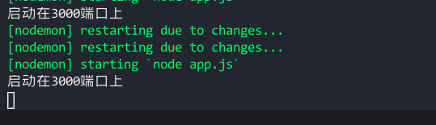
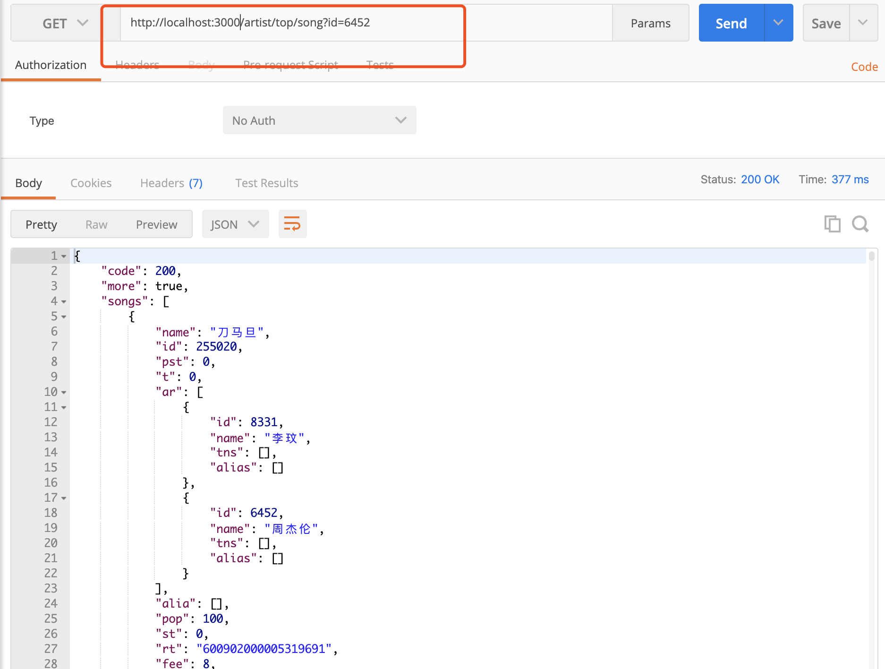

- 安装node

安装地址：https://nodejs.org/en/

> windows电脑和mac电脑直接傻瓜式安装就可以。
>
> 如果windows电脑的同学安装node时,选到了其它的磁盘，请记得修改环境变量

- 检查是否已安装成功

  打开终端，键入：

  ```js
  //查看到对应的版本 证明已安装成功
  node --version 
  ```

  ```js
  npm --version
  ```

  

- 接下来安装`nodemon`

  在编写调试Node.js项目，修改代码后，需要频繁的手动close掉，然后再重新启动，非常繁琐。现在，我们可以使用`nodemon`这个工具，它的作用是监听代码文件的变动，当代码改变之后，自动重启。

- 下载

  ```js
  npm install -g nodemon
  
  //下载完成之后 nodemon -v查看版本 如果有证明安装成功
  ```

- 以上配置完成之后，启动我们的后端项目

  ```js
  cd vue-server //切换到项目根目录下
  npm install //下载对应的依赖包
  npm start //启动项目
  //看到如下图证明 node服务端运行成功
  ```

  

- 作业需求的接口地址将做如下更改

  ```js
  将所有的https://autumnfish.cn这个地址替换成http://localhost:3000
  ```

- 大家可以先拿postman工具进行测试，接口没问题了，再往下做作业。如有问题，请私聊小马哥老师

  